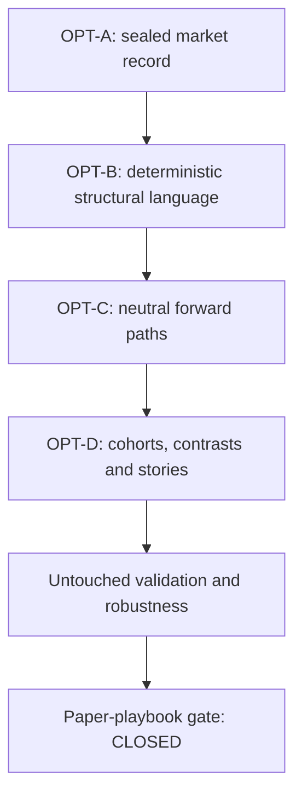

# OVC OPT-A–D Complete Development Summary

**As of:** 19 July 2026  
**Instrument:** GBP/USD BID  
**Current condition:** deterministic research pipeline complete through the paper-playbook gate; gate closed  
**Probability, edge, paper-execution and live-execution authority:** `NONE`

## 1. Executive summary

OVC has progressed from a design vocabulary into a reproducible, manifest-bound research pipeline:

The current version can ingest provider data, preserve gaps, aggregate only complete bars, classify all seven OPT-B terms, maintain a ratified parallel-axis state, measure strictly complete forward paths, build overlap-aware cohorts and contrasts, form repeated-story hypotheses, validate them on a non-overlapping year, and apply a deterministic promotion gate.

It cannot currently justify a paper playbook. Although 197 of 202 frozen qualitative stories reappeared in the 2025 holdout, every hypothesis also produced at least as many contradictory-response clusters as matching clusters. This counter-story condition survived every leave-one-month-out test. The final gate therefore returned `0 PASS / 0 DEFER / 202 BLOCK`.

The system is a validated research instrument, not a validated predictive or trading system.

## 2. Current version at a glance

| Layer | Current authority | Current version or decision | Status |
|---|---|---|---|
| OPT-A discovery data | Immutable research input | `OPT-A.GBPUSD.2026H1.v1` | Sealed |
| OPT-A validation data | Immutable 15M holdout input | `OPT-A.GBPUSD.2025.v1` | Sealed; holdout now consumed |
| OPT-B language | Seven deterministic structural terms | `B-LANG-0.1-SEED` | Frozen for comparability |
| OPT-B relevance | Range supersession plus acceptance-through retirement; no TTL | `B-REF-0.2-STRUCTURAL-ONLY` | Ratified for research |
| OPT-B state | Parallel axes with acceptance represented by frontier advance | `B-STATE-0.3b-FRONTIER-ACTIVE-RESEARCH` | Ratified for descriptive research |
| OPT-C anchors | Compound event anchors tied to bar close and B-state | `OPT-C-OUTCOME-0.1` | Ratified and built |
| OPT-C path coverage | Exact 15M paths; censored paths retained without outcomes | `OPT-C-COVERAGE-0.1` | Verified |
| OPT-C measurement | Neutral descriptive outcomes | `OPT-C-MEASURE-0.1.1` | Verified; v0.1 superseded |
| OPT-C semantics | Arithmetic, nesting, frontier and overlap review | `OPT-C-SEMANTIC-REVIEW-0.1` | Pass with controls |
| OPT-D cohorts | Cross-clock overlap clusters and support bands | `OPT-D-COHORT-0.1` | Complete, descriptive only |
| OPT-D contrasts | Cluster-balanced contrasts and counterexamples | `OPT-D-CONTRAST-0.1` | Complete, descriptive only |
| OPT-D stories | Repeated qualitative archetypes and evidence packs | `OPT-D-STORY-0.1` | Complete, descriptive only |
| OPT-D review | Frozen 202-hypothesis register | `OPT-D-REVIEW-0.1` | Ratified for validation |
| OPT-D validation | Non-overlapping 2025 holdout | `OPT-D-VALIDATE-0.1` | Complete |
| OPT-D robustness | Twelve exact month-deletion tests per hypothesis | `OPT-D-ROBUSTNESS-0.1` | Complete; no promotion authority |
| Paper-playbook gate | Mandatory failure-condition gate | `PAPER-PLAYBOOK-GATE-0.1` | Closed; no candidate authorized |

## 3. Development chronology

### 3.1 Foundation and operating language

The initial foundation defined the successor-system boundary and the A→D research flow. The North Star charter, successor handover, vNext discovery plan and ABCD operating-language seed established that:

- observations must remain separate from interpretations and outcomes;
- missing market records may not be manufactured;
- structural classifications are not trade signals;
- forward outcomes are neutral measurements, not wins or losses;
- repeated stories require counterexamples, temporal variation and untouched validation;
- no stage silently inherits execution authority.

The first deterministic OPT-B contract then froze seven terms: `COMPRESSION`, `DISPLACEMENT`, `SWEEP`, `RECLAIM`, `ACCEPTANCE`, `REJECTION`, and `TRANSITION`.

## 4. OPT-A — trusted market record

### 4.1 Provider adapter and first replay

The Dukascopy adapter was built to normalize offset-aware timestamps to UTC, preserve BID OHLC, detect gaps, split replay segments and reject incomplete aggregation buckets. The first one-day M1 replay established that classifiers do not bridge missing data.

### 4.2 Six-month hourly source

Six monthly H1 files covering `[2026-01-01, 2026-07-01)` were ingested and deterministically aggregated to fixed-UTC 2H bars:

- 3,075 provider H1 bars;
- 1,521 accepted 2H bars;
- 26 expected closure discontinuities;
- 33 partial boundary buckets rejected;
- zero unexplained intraweek gaps.

### 4.3 Direct six-month M1 retrieval

The same provider was retrieved directly for GBP/USD M1 BID:

- 183,619 provider-returned minutes;
- no synthetic flat candles;
- 11,830 complete 15M bars;
- 1,312 complete M1-chain 2H bars;
- sparse intervals quarantined rather than filled.

### 4.4 H1/M1 reconciliation and discovery seal

The apparent 209-bar 2H difference was fully reconciled:

- all 1,312 bars accepted by both paths had identical OHLC;
- all 209 H1-only bars contained 1–15 absent minute records but the available provider minutes reproduced the H1-derived 2H OHLC;
- zero price disagreements were found;
- 780 absent minute records were involved;
- no missing minute was reconstructed.

The authority split was sealed as `OPT-A.GBPUSD.2026H1.v1`:

- 2H spine: provider H1 → exact 2H aggregation;
- 15M detail: complete provider M1 chains only;
- 209 2H bars retain `M1_DETAIL_INCOMPLETE` lineage;
- incomplete 15M bars remain quarantined;
- seal hash: `0927f7a2b078d670370eb9ec26718f3e2ff0d97708df1f785a9333264415ef99`.

### 4.5 Untouched 2025 validation seal

A new direct provider year `[2025-01-01, 2026-01-01)` was retrieved and sealed separately:

- 371,074 M1 BID rows;
- source SHA-256: `613abc547b5a53ac982c02ae68c4c3046c69a737cb70a080da3e058bc7cdf6ac`;
- 23,824 complete 15M bars;
- 1,076 touched incomplete 15M buckets quarantined;
- 677 contiguous 15M segments;
- 2,633 M1-chain 2H bars retained as context only;
- seal hash: `85c1ce9f7721b33c4aef97a86561bd3c6fd8bc7681214a689d56bf147d4575d4`.

The 2025 release was used only after the 202 frozen hypotheses and validation thresholds were ratified. It is now opened evidence and cannot be reused as untouched confirmation.

## 5. OPT-B — deterministic market language and state

### 5.1 Reference-level registry

A deterministic registry was built from closed bars only:

| Timeframe | Swing high | Swing low | Range high | Range low | Total |
|---|---:|---:|---:|---:|---:|
| 15M | 1,366 | 1,381 | 4,341 | 4,400 | 11,488 |
| 2H | 189 | 180 | 545 | 575 | 1,489 |

Rules included strict two-left/two-right confirmed swings, eight-bar rolling ranges, no gap crossing and first-valid timestamps that prevent look-ahead.

### 5.2 Complete seven-term historical replay

The full H1 discovery release was replayed against every eligible level:

| Clock | Level–bar evaluations | Materialized records | Transitions | Initial ambiguous bars |
|---|---:|---:|---:|---:|
| 15M | 288,769,346 | 2,624,005 | 5 | 6,922 |
| 2H | 4,250,248 | 81,708 | 3 | 722 |

The replay showed that retaining every historical level indefinitely created a very large ambiguity surface. It also exposed and corrected a packaging/transfer defect: the originally saved complete-replay ZIP contained a truncated 15M gzip member. The 15M stream was deterministically regenerated and matched the original manifest’s compressed and canonical hashes exactly. Only the separately named `REPAIRED` package should be used.

### 5.3 Relevance and retirement

Five policies and three threshold profiles were reviewed without OPT-C outcomes. Structural retirement—rolling-range supersession plus confirmed acceptance-through—reduced ambiguity from 58.51% to 8.38% at 15M and from 47.47% to 8.74% at 2H. Time-to-live variants added little and sometimes left bars with no active reference.

`STRUCTURAL_ONLY` was ratified. No elapsed-time expiry, ranking score, nearest-level rule or hidden best-level selector was authorized. Seed language thresholds remained frozen because compression and displacement counts were materially threshold-sensitive.

### 5.4 B-STATE-0.2 compound state and neutral exit

The first persistent compound-state model:

- collapsed agreeing same-label levels into one state;
- retained conflicting top-precedence labels as `AMBIGUOUS`;
- persisted state until replacement or explicit invalidation;
- required two contiguous bars for a neutral exit;
- reset pending exits across gaps without manufacturing neutrality.

It exposed the semantic problem that acceptance occupied 86.86% of 15M bars and 81.53% of 2H bars, while suppressing 1,245 and 136 lower-precedence triggers respectively.

### 5.5 B-STATE-0.3 parallel axes

Acceptance/location, displacement, compression, interaction and quality were separated into parallel axes so acceptance could not suppress other evidence. Genuine conflict fell to 0%, but a categorical accepted corridor then occupied 99.67% of 15M and 97.63% of 2H bars. v0.3 was therefore replayed but not ratified.

### 5.6 B-STATE-0.3a relation inventory

Acceptance was changed from a persistent categorical state into:

- a one-bar current acceptance event; and
- a complete level-relation inventory that remains observable but non-governing.

Event occupancy fell to 28.59% at 15M and 24.98% at 2H, with median one-bar duration. This removed semantic dominance from the categorical state model. The representation boundary was ratified, while raw confirmations remained audit evidence.

### 5.7 B-STATE-0.3b frontier advance

Three acceptance views were compared: raw confirmation, boundary confirmation and outward frontier advance. `FRONTIER_ADVANCE` was approved as the primary timeline event:

| Clock | Frontier events | Occupancy | Median duration | Any-axis active | Genuine conflict |
|---|---:|---:|---:|---:|---:|
| 15M | 1,411 | 11.93% | 1 bar | 46.35% | 0.00% |
| 2H | 162 | 10.65% | 1 bar | 37.48% | 0.00% |

Raw confirmations remain audit evidence, boundary confirmations remain diagnostic, and the full relation inventory remains machine authority behind the compact frontier projection. `B-STATE-0.3b-FRONTIER-ACTIVE-RESEARCH` is the current OPT-B state authority.

## 6. OPT-C — neutral forward-path measurement

### 6.1 Event-anchor ledger

The ratified B-state was transformed into one compound event row per event-bar close:

| Clock | Anchors | Components | Compound anchors | Multi-family anchors |
|---|---:|---:|---:|---:|
| 15M | 3,845 | 5,193 | 1,038 | 705 |
| 2H | 459 | 607 | 123 | 65 |

This prevented simultaneous term evidence from being duplicated into separate outcome observations.

### 6.2 Strict seven-horizon coverage and censoring

Every anchor was checked at 1h, 2h, 4h, 8h, 12h, 24h and 48h using exact 15M intervals. Censored records remained explicit and received no measured outcome.

The H1 discovery seal supported measurement at 1–12h, only 36 complete observations at 24h, and zero at 48h. Therefore:

- 1–12h: measurement authority;
- 24h: coverage-only;
- 48h: blocked.

### 6.3 Neutral measurement and repair

`OPT-C-MEASURE-0.1` measured returns, upward/downward excursions, direction-normalized excursions, timing, continuation, frontier retests/losses, endpoint state and transition lineage for complete paths.

The semantic review found 31 directional rows that named a primary frontier type while no applicable frontier test existed. `OPT-C-MEASURE-0.1.1` repaired only that representation by making those frontier fields null. Prices, paths, returns, excursions, anchors and overlap values did not change. v0.1 is preserved as superseded evidence.

The verified v0.1.1 release contains 14,979 complete event–horizon measurements: 13,382 on the 15M event clock and 1,597 on the 2H event clock.

### 6.4 Semantic sanity review

All arithmetic identities, excursion bounds, direction normalization, extreme timing, frontier relations and nested-horizon invariants passed with zero violations.

The decisive constraint was overlap: from 92.32% of 15M 1h observations to 100% of 15M 8h/12h observations overlapped another forward window. Downstream comparison therefore had to use connected overlap clusters rather than treating rows as independent.

The 160-cell clock × horizon × family × direction matrix contained 45 adequate, 29 limited, 55 sparse and 31 empty cells. Sparse cells remained inventory-only.

## 7. OPT-D — cohorts, contrasts, stories and validation

### 7.1 Cluster-aware cohorts

Forward windows were converted into connected components across both event clocks:

| Horizon | Outcome rows | Overlap clusters | Median cluster size | Maximum size |
|---:|---:|---:|---:|---:|
| 1h | 4,021 | 689 | 3 | 41 |
| 2h | 3,776 | 301 | 6 | 53 |
| 4h | 3,322 | 156 | 24 | 76 |
| 8h | 2,386 | 123 | 20 | 68 |
| 12h | 1,474 | 117 | 13 | 59 |

Only descriptive-ready cohorts could proceed. Cluster count was retained as a dependency-control unit, not claimed as statistical independence.

### 7.2 Cluster-balanced contrasts

Forty-two predeclared contrasts were built: 11 direction-symmetry, 24 family-context and seven exact-signature comparisons. After exclusivity controls, 37 were descriptive-ready, four limited and one inventory-only. Shared multi-family outcomes were excluded from both arms and retained explicitly. A total of 26,816 counterexample memberships remained visible.

### 7.3 Repeated-story evidence

The 37 admitted contrasts produced:

- 1,830 qualitative story archetypes;
- 33,834 contrast-arm story memberships;
- 37 evidence packs;
- 370 representative cases;
- 202 archetypes with repeated descriptive support;
- 449 limited, 309 minimal and 870 singleton archetypes.

### 7.4 Evidence review and hypothesis ratification

All 202 repeated-support archetypes entered an outcome-neutral review. No candidate was selected because its discovery path looked favorable. The frozen batch contained:

- 202 15M hypotheses;
- horizons: 62 at 1h, 61 at 2h, 50 at 4h, 29 at 8h;
- directions: 104 DOWN, 98 UP;
- endpoint alignment: 81 aligned, 121 opposite;
- 78 complete directional pairs and 46 unpaired candidates;
- a deterministic competing response for every candidate.

The full batch was ratified before opening the 2025 holdout. Evaluation required at least 10 antecedent clusters across four months; reappearance required at least 10 exact matching clusters across four months. Threshold optimization during holdout was prohibited.

### 7.5 Untouched 2025 validation

All 202 hypotheses were evaluable:

| Result | Hypotheses |
|---|---:|
| Reappeared with counter-story alert | 197 |
| Did not reappear and had counter-story alert | 5 |
| Total counter-story alerts | 202 |

The validation established broad structural recurrence but not discrimination. Matching stories were consistently accompanied by a larger contradictory-response surface.

### 7.6 Robustness review

Each hypothesis was recomputed after removing each of the twelve holdout months—2,424 exact month-deletion decisions. Clusters were rebuilt from remaining rows rather than approximated by subtracting monthly totals.

- 187 hypotheses retained reappearance under every month deletion;
- all 202 retained the counter-story alert under every deletion;
- contradictory-to-matching cluster ratios ranged from 1.6143 to 44.7273, with a 6.1544 median;
- all 156 rows belonging to the 78 complete directional pairs were concordant on baseline recurrence, counter alert and leave-one-month-out stability.

### 7.7 Paper-playbook gate

The gate required valid lineage, strict censoring handling, evaluable antecedent support, structural reappearance, no counter-story alert and leave-one-month-out recurrence.

Final result:

- `PASS`: 0;
- `DEFER`: 0;
- `BLOCK`: 202;
- paper-playbook authorizations: 0;
- paper playbooks created: 0;
- paper-execution authority: none;
- live-execution authority: none.

## 8. What the current version can and cannot claim

| Claim or capability | Current answer |
|---|---|
| Provider data are preserved with explicit gaps and hashes | Yes |
| 15M and 2H aggregation authority is deterministic | Yes, within each OPT-A seal’s stated resolution boundary |
| OPT-B terms and state are deterministic and replayable | Yes |
| Acceptance semantic dominance was repaired | Yes; current primary event is frontier advance |
| Forward outcomes are measured without path filling | Yes, for authorized complete horizons |
| Overlapping observations are controlled structurally | Yes, through connected overlap clusters |
| Repeated stories exist structurally | Yes |
| Those stories discriminate expected from contradictory outcomes | No |
| Conditional probability or predictive edge is established | No |
| A paper playbook is authorized | No |
| Paper or live execution is authorized | No |

## 9. Canonical, historical and invalid artifacts

### Use as current authority

- `OVC_OPT_A_SEALED_RELEASE_2026_H1.zip`
- `OVC_OPT_A_GBPUSD_2025_SEALED_SOURCE.zip`
- `OVC_OPT_B_COMPLETE_REPLAY_2026_H1_v0_1_REPAIRED.zip`
- `OVC_OPT_B_STATE_RATIFIED_RELEASE_2026_H1_v0_3b.zip`
- `OVC_OPT_C_EVENT_ANCHOR_LEDGER_2026_H1_v0_1.zip`
- `OVC_OPT_C_FORWARD_PATH_COVERAGE_AUDIT_2026_H1_v0_1.zip`
- `OVC_OPT_C_NEUTRAL_OUTCOMES_2026_H1_v0_1_1.zip`
- `OVC_OPT_C_SEMANTIC_SANITY_REVIEW_2026_H1_v0_1.zip`
- `OVC_OPT_D_CLUSTER_COHORTS_2026_H1_v0_1.zip`
- `OVC_OPT_D_CLUSTER_CONTRASTS_2026_H1_v0_1.zip`
- `OVC_OPT_D_STORY_EVIDENCE_2026_H1_v0_1.zip`
- `OVC_OPT_D_EVIDENCE_REVIEW_2026_H1_v0_1.zip`
- `OVC_OPT_D_VALIDATE_GBPUSD_2025_v0_1.zip`
- `OVC_OPT_D_ROBUSTNESS_REVIEW_GBPUSD_2025_v0_1.zip`
- `OVC_PAPER_PLAYBOOK_GATE_GBPUSD_2025_v0_1.zip`

### Preserve for semantic and version lineage

- B-STATE-0.2 compound-state evidence;
- B-STATE-0.3 categorical parallel-axis comparison;
- B-STATE-0.3a relation-inventory replay;
- B-STATE-0.3b pre-ratification semantic review;
- historical reference-engine versions v0.2–v0.8;
- historical OPT-C outcome-engine versions v0.1–v0.3;
- OPT-C neutral outcomes v0.1 before the nullability repair;
- all draft, deterministic-reproduction and independently verified directories.

These objects explain how the current contracts were reached. They do not supersede the ratified/final releases.

### Do not use as current evidence source

- `OVC_OPT_B_COMPLETE_REPLAY_2026_H1_v0_1.zip`: preserved transfer-defect archive; use the `REPAIRED` package.
- `OVC_OPT_B_REFERENCE_ENGINE_v0_7_INVALID_REPLAY_COPY.zip`: explicitly invalid replay copy.
- hidden partial ZIP/upload fragments, temporary regeneration streams, PID files, package caches and compiled `__pycache__` files: operational residue, not research evidence.

## 10. File discovery and purpose inventory

Two inventories accompany this report:

1. `OVC_ABCD_LOCAL_FILE_INVENTORY.csv` — every scoped local ABCD file, with stage, artifact class, lifecycle status, byte size and purpose.
2. `OVC_ABCD_LIBRARY_FILE_INDEX.csv` — every saved user-facing ABCD deliverable found from 17–19 July 2026, with stage, status, size, creation time and purpose.

### Local discovery totals

The final inventory contains **884 scoped files** occupying **4,998,399,870 bytes**. The high byte count is mainly the exhaustive OPT-B evidence streams plus draft, reproduction and verification copies—not 884 independent authoritative versions.

| Stage | Files |
|---|---:|
| OPT-A | 65 |
| OPT-B | 330 |
| OPT-C | 191 |
| OPT-D | 248 |
| Paper-playbook gate | 18 |
| Shared infrastructure | 32 |

| Lifecycle class | Files |
|---|---:|
| Current implementation source | 104 |
| Canonical or ratified release | 113 |
| Independently verified release copy | 115 |
| Deterministic reproduction | 164 |
| Draft, non-canonical | 94 |
| Historical semantic lineage | 35 |
| Generated research artifact | 213 |
| Packaged deliverable or historical package version | 28 |
| Imported parent input | 6 |
| Repair workspace | 8 |
| Current repaired complete replay | 1 |
| Current repaired OPT-C measurement | 1 |
| Superseded OPT-C v0.1 measurement | 1 |
| Explicitly invalid artifact | 1 |

### Saved deliverables

The saved-file scan found **64 ABCD deliverables** from this build window. They include the foundation documents, provider data and ingestion reports, reconciliation workbook, sealed releases, successive engine packages, every canonical OPT-C/D release, validation and robustness reports, and the paper-playbook gate.

### Artifact-purpose glossary

| File type or naming pattern | Purpose |
|---|---|
| `*_MANIFEST.json` | Binds release lineage, artifact hashes, counts, contract version and authority boundary. |
| `*_VALIDATION.json` / `*_VERIFICATION.json` | Machine-readable independent integrity and determinism result. |
| `*_VALIDATION.md` / `*_VERIFICATION.md` | Human-readable verification summary. |
| `*_REPORT*.md` | Human-readable findings, decisions and interpretation limits. |
| `*_CONTRACT*.md` | Frozen deterministic rules and semantic authority. |
| `*_CHECKLIST*.md` | Operator decisions required before ratification. |
| `*_RATIFICATION_RECORD.md` / `*_APPROVAL_RECORD.md` | Explicit operator authority decision. |
| `*.jsonl.gz` | Canonical machine evidence stream, such as terms, states, anchors, outcomes, memberships or gate decisions. |
| `accepted_15m.csv` / `accepted_2h.csv` | Canonical complete bars under the enclosing OPT-A seal. |
| gap/rejected ledgers | Explicit missing-data and quarantine evidence; never repaired data. |
| `*_summary.json` | Machine-readable aggregate counts and rates. |
| engine `*.zip` | Portable source, scripts, contracts and tests for the named version. |
| release `*.zip` | Portable evidence and manifest bundle for the named research release. |

### Current source tree

The active prototype contains:

- **22 engine modules** covering models/primitives, Dukascopy ingestion, levels, classifiers, complete replay, relevance, state v0.2/v0.3/v0.3a/v0.3b, OPT-C measurement, semantic review, cohorts, contrasts, stories, hypothesis review, holdout validation and robustness;
- **40 build/validation scripts** for reproducible release construction and independent checks;
- **25 contracts, checklists, approval and repair records**;
- **19 test modules** with **107 passing tests**.

Key implementation modules and their purpose:

| Module | Purpose |
|---|---|
| `providers/dukascopy.py` | Parse provider timestamps and aggregate only complete fixed-time buckets. |
| `levels.py` | Build confirmed swings and rolling range boundaries without look-ahead. |
| `classifiers.py` | Implement the seven deterministic OPT-B terms. |
| `full_replay.py` / `replay.py` | Gap-safe exhaustive term replay and state materialization. |
| `relevance.py` | Structural level lifecycle and retirement. |
| `state_v02.py` | Historical compound-state and explicit neutral-exit model. |
| `state_v03.py` | Parallel-axis state and genuine-conflict semantics. |
| `state_v03a.py` | Acceptance-event plus relation-inventory representation. |
| `state_v03b.py` | Boundary and frontier-advance acceptance views. |
| `opt_c.py` | Event direction, exact path coverage and neutral measurement. |
| `semantic_review.py` | OPT-C arithmetic, nesting, overlap and support checks. |
| `cohorts.py` | Cross-clock overlap clusters and cohort readiness. |
| `contrasts.py` | Cluster-balanced contrast construction. |
| `stories.py` | Qualitative archetypes and representative-case selection. |
| `review.py` | Frozen hypothesis definitions, mirrors and counter-story rules. |
| `holdout_validation.py` | Exact untouched-validation evaluation. |
| `robustness.py` | Month-deletion robustness and paper-playbook gate logic. |

### Discovery exclusions

The inventories intentionally exclude environment and transfer residue that is not an OVC artifact: `.npm-cache`, `node_modules`, compiled `__pycache__`, hidden partial upload files, PID directories and unnamed temporary blobs. Imported parent ZIPs are retained in the local inventory as `IMPORTED_PARENT_INPUT`, not mislabelled as newly authored releases.

## 11. Current blocker and next valid build

The current blocker is semantic discrimination, not missing infrastructure. The pipeline works; the frozen stories do not separate their expected responses from counter-stories.

The next valid build is `OPT-D-REFINE-0.2`:

1. use discovery-authority/opened research data to examine why the same antecedent supports opposing responses;
2. propose a smaller number of pre-event discriminators without looking at a new holdout;
3. preserve all counterexamples and report support loss caused by each refinement;
4. freeze the revised antecedent and response definitions;
5. obtain a new, non-overlapping OPT-A validation interval;
6. rerun untouched validation, robustness and the paper-playbook gate.

The 2025 interval may support exploratory diagnosis now that its result is known, but it may never again be described as untouched validation for a revised hypothesis.

## 12. Final status statement

OVC ABCD is currently a complete deterministic research stack with sealed data, ratified structural semantics, neutral outcome measurement, overlap-aware evidence construction, untouched validation and a functioning promotion gate. The gate has correctly refused promotion. No paper playbook, probability estimate, predictive edge, risk policy or execution authority exists in this version.
